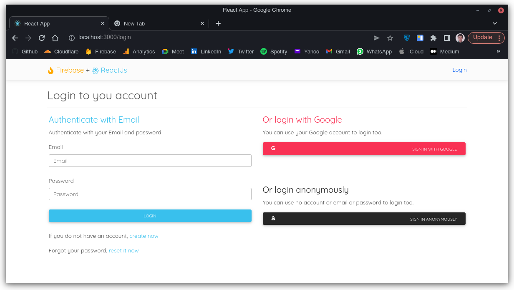
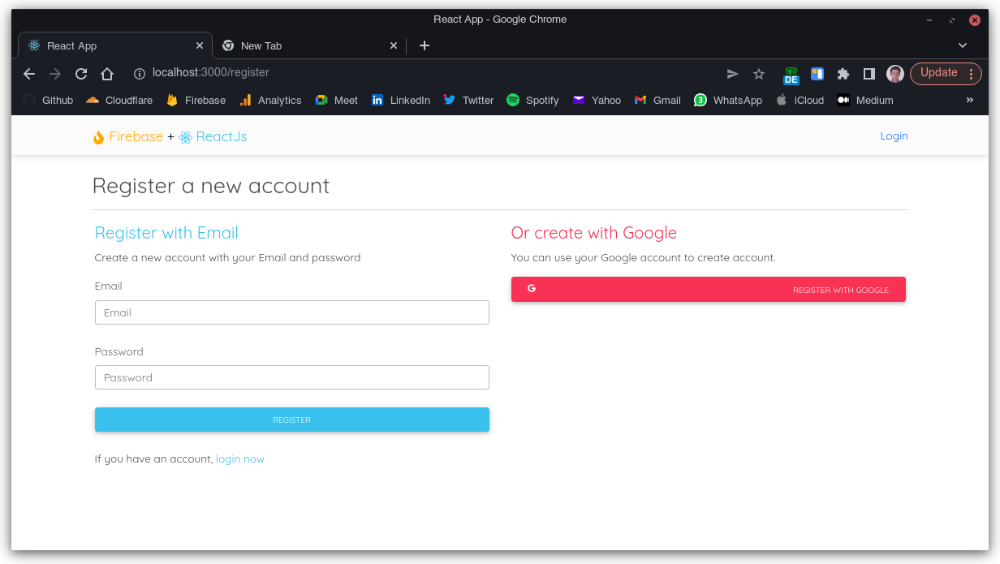
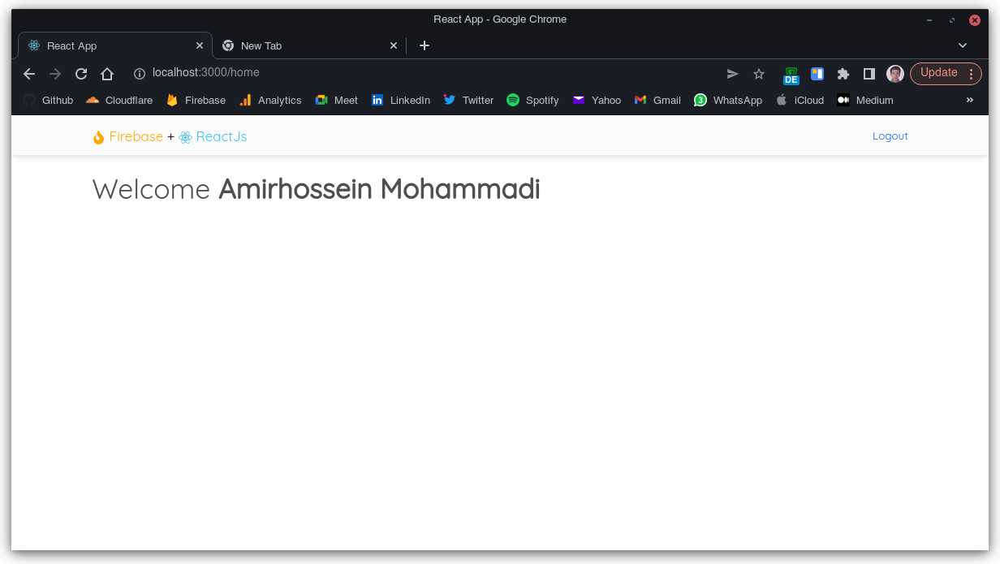

# React + Firebase

This is a practical project where we learned how to use **Firebase** as back-end for out **React** application.

## About app

This is a sample to use **Firebase Authentication** methods like:

- Authenticate with Email & Password
- Authenticate Anonymously
- Create account with Email & Password
- Authenticate with Google account
- Use reset password method

### Take a look

Here is the login page:

Here is the register page:

Here is the reset password page:

And last is home:

